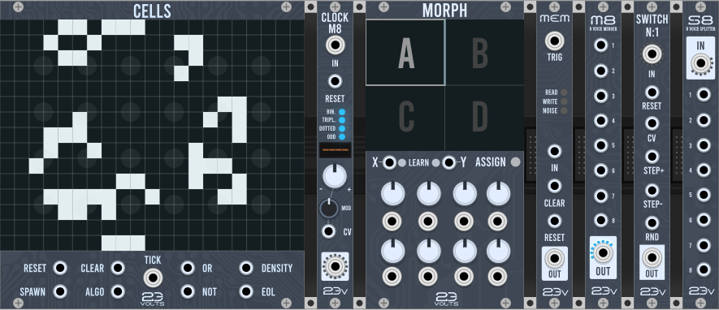

# 23Volts modules for VCV Rack

This is a free collection of modules for the [VCVRack](http://vcvrack.com) open source modular synthetizer.  

## Cells

Cells is a "cellular automata" sequencer based on the [Conway's game of life](https://en.wikipedia.org/wiki/Conway%27s_Game_of_Life). It generates deterministic sequences using the base algorithm and some variations of it.  

- **TICK** : advances to the next generation. When a cable is patched on the grid and has 1 of its 4 neighbours cells alive, it produces a short pulse of the same length of the input clock. When it has 2 or more cells alive, it produces a gate that stays open until the next tick. 

- **ALGO** : Select the current algorithm with a (0-10v) CV signal, otherwise set through the context menu.

- **SPAWN** : generate a new random shape on the grid.

- **CLEAR** : clear the grid and initial state.

- **RESET** : set the grid to the same state it had when the last spawn was triggered. As the algorithm is deterministic, this will result in a loop.

- **DENSITY** : outputs a 0-10v CV value which represents how many cells are "alive" on the grid. 

- **EOL** : A gate which opens when a *"End Of Life"* situation happens, which can be either a stale state or an infinite loop. 

- **OR** : outputs a gate when any of the patched cable is active.

- **NOT** : outputs a gate when none of the patched cables are active. 

## Morph

Morph combines 8 offset generators with a XY Pad which allows to smoothly interpolate between four different "snapshots" of the offset knob's positions. This is a powerful tool for soundesign and live performances. The offset can output from -10  to +10 volts.  

- **X** : allows CV control of the X axis. 

- **Y** : allows CV Control of the Y axis

Alternatively, clicking the **ASSIGN** allows for direct mapping of any parameters of other VCV rack modules. 

## ClockM8

**ClockM8** is a simple yet versatile polyphonic clock modulator. It takes 1 to 16 clocks in its polyphonic input, and outputs up to 16 divided/multiplicated versions of them. 

The ratio is set by the main knob, which can be (polyphonicaly) modulated with the **mod CV input**. The module is designed to stay in sync even if receiving extreme modulation; furthermore, the allowed ratios can be quantized to the following values for more musical results : 

- **Binary** : all strictly binary values 
- **Triplets** : all multiples of 3 
- **Dotted** : dotted binary values
- **Odd** : all other ratios not present in the other like 5,7,9...

**RESET** : The module uses a downbeat approch, which means that regardless of the division/multiplication ratio, the 1st modulated pulse will always generated on the 1st clock tick received after a reset. Also, when a **TRIG** is received from the **CLOCK IN** when the module was not running, a **RESET** signal is internally generated.   

> **About polyphony**: The number of clocks channels of the polyphonic output is defined by the biggest number of channels from the 3 polyphonic inputs (Clock, Mod, Reset). For example, having 2 different resets with a single clock input it will output 2 clocks with a different reset, the first clock input being copied to the 2nd ClockM8 channel.
   

### Setting up output mode : 

By accessing the context menu with a right click you can choose what kind of pulses **ClockM8**. **Trigger** will produce a really short pulse, and **Gate** will produce a pulse half the lenght of the current ratio. 

## Mem

Mem is a Sample & Hold with an internal memory & noise generator that allows for repetable randomness. The size of the memory can be set from 1 to 16K samples, by accessing the context menu. When the end of the memory is reached, *Mem* will switch to its noise generator.  

## Merge8 + Split8

Merge8 and Split8 are respectively a 8 channels polyphonic merger and a 8 channels splitter, only taking 3HP each.

## Merge4 + Split4

Merge4 and Split4 are respectively a 2x4 channels polyphonic merger and a 2x4 channels splitter, only taking 3HP each.

## SwitchN1

SwitchN1 is a polyphonic sequential switch. It takes up to 16 channels as an input which are routed to a mono output. 

The number of step is defined by the number of channels from the input.

- **RESET** : Switch to channel 0. 

- **UP** : Switch to the next channel.

- **DOWN** : Switch to the previous channel

- **RND** : Switch to a random channel. 

- **CV** : Offset the current step with a -5/+5volts signal

## MIDI-PC

MIDI-PC is a simple utility module aimed at sending and receiving MIDI Program Change message from and to VCV rack.

## Multimap

Multimap is a MIDI mapping tool with feedback which can use the same MIDI-CC or notes and assign them to up to 128 banks of different assignments inside VCV. 

It comes in 2 versions; one version has 16 knobs and one version has 16 switches.

## Mono Poly

Mono poly takes a mono input and copy the signal to N polyphonic channels. The number of channels can be set by CV.

## Polymerge & Polysplit

Polymerge & Polysplit are channel-variable merger & splitter. Right click on the module allows for selecting the number of channels of the inputs / outputs.

## Contact

If you found a bug or would like to suggest a new feature, please open a github issue. In the case you don't have a github account nor want to create one, feel free to send an email at **23volts@gmail.com**

## Donating

If you use these modules and enjoy them, and would like to support their development, you can make a donation through [PayPal](https://www.paypal.me/23volts)  